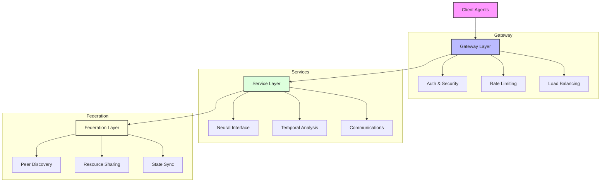

# Agentic_Robots.txt Specification

## Empowering the Next Generation of Web Automation

Agentic_Robots.txt revolutionizes how autonomous agents interact with web applications by extending the traditional robots.txt protocol into a comprehensive framework for programmatic discovery and interaction. This specification bridges the gap between static web crawling and dynamic, intelligent agent interactions.

## Why Agentic_Robots.txt?

- 🔍 **Smart Discovery**: Autonomous agents can dynamically discover and understand application capabilities
- 🤝 **Seamless Integration**: Standardized protocols for agent-application communication
- 🌐 **Federation Ready**: Built-in support for cross-deployment coordination
- 🔒 **Enterprise Security**: Advanced authentication and authorization framework
- ⚡ **Real-time Enabled**: Native support for WebSocket and event-based communication
- 📊 **Observable**: Comprehensive health monitoring and metrics

## System Architecture



## Technical Documentation

📚 **Comprehensive Documentation**
- [Architecture Deep Dive](docs/architecture.md) - System design and components
- [Federation Protocol](docs/federation.md) - Distributed coordination framework
- [Security Guide](docs/security.md) - Authentication and authorization
- [Getting Started Tutorial](docs/tutorials/getting-started.md) - Quick implementation guide

## Core Protocol Features

### Discovery Chain
The specification implements a hierarchical discovery mechanism that allows agents to progressively explore and understand application capabilities:

```
robots.txt → manifest.json → capability files
```

### Communication Channels
Multiple communication methods support diverse interaction patterns:
- RESTful API endpoints for standard request-response
- WebSocket connections for real-time bidirectional communication
- Server-Sent Events for system updates and notifications

### Security Model
Enterprise-grade security features:
- JWT-based authentication
- Role-based access control
- Rate limiting and request validation
- TLS encryption with key rotation

### Federation Support
Built-in distributed coordination capabilities:
- Automatic peer discovery
- Resource sharing and load distribution
- State synchronization
- Trust verification

## Implementation Requirements

### Mandatory Features
- Extended robots.txt directives
- .well-known directory structure
- JSON schema validation
- HTTP/2 support
- WebSocket capabilities
- JWT authentication

### Optional Enhancements
- Federation protocol support
- Custom capability definitions
- Advanced monitoring systems
- Version control integration

## Versioning

This specification follows semantic versioning:
- MAJOR version for breaking changes
- MINOR version for new features
- PATCH version for bug fixes

## Community and Support

- 📝 [Submit Issues](https://github.com/yourusername/agentic-robots-txt/issues)
- 💬 [Join Discussions](https://github.com/yourusername/agentic-robots-txt/discussions)
- 📰 [Release Notes](https://github.com/yourusername/agentic-robots-txt/releases)

## License

MIT License - See [LICENSE](LICENSE) file for details