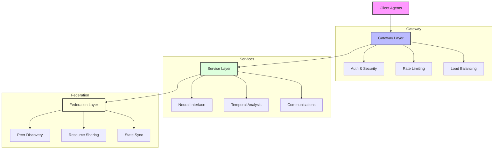

# Agentic_Robots.txt Specification

## Empowering the Next Generation of Web Automation

Agentic_Robots.txt revolutionizes how autonomous agents interact with web applications by extending the traditional robots.txt protocol into a comprehensive framework for programmatic discovery and interaction. This specification bridges the gap between static web crawling and dynamic, intelligent agent interactions.

## Why Agentic_Robots.txt?

- 🔍 **Smart Discovery**: Autonomous agents can dynamically discover and understand application capabilities
- 🤝 **Seamless Integration**: Standardized protocols for agent-application communication
- 🌐 **Federation Ready**: Built-in support for cross-deployment coordination
- 🔒 **Enterprise Security**: Advanced authentication and authorization framework
- ⚡ **Real-time Enabled**: Native support for WebSocket and event-based communication
- 📊 **Observable**: Comprehensive health monitoring and metrics

## Technical Foundation: Extending robots.txt

### The Evolution of Web Crawling

The robots.txt protocol, established in 1994, has been the standard method for websites to communicate with web crawlers and bots. This simple text file provides basic instructions about which parts of a site should or shouldn't be accessed by automated agents. However, as web applications become more sophisticated and AI agents more capable, we need a more comprehensive protocol for agent-application interaction.

### Traditional robots.txt
```
User-agent: *
Disallow: /private/
Allow: /public/
Sitemap: http://example.com/sitemap.xml
```

Traditional robots.txt is limited to:
- Basic crawling permissions
- Sitemap locations
- Crawl-delay suggestions
- Simple pattern matching

### The Agentic Extension

In today's AI-driven world, the relationship between websites and autonomous agents needs to evolve beyond simple access control. Agentic_Robots.txt represents a paradigm shift from blocking agents to enabling secure, structured collaboration between AI agents and web applications.

#### Core Extension Principles

```
# Standard directives
User-agent: *
Allow: /
Disallow: /private/

# Agentics Extensions
Agentics-Manifest: /.well-known/agentics-manifest.json
Agentics-Version: 1.0.0
Agentics-Capabilities: neural,temporal,communications
Agentics-Federation: enabled
Agentics-Auth: jwt
Agentics-Realtime: websocket,sse
```

#### Beyond Basic Access Control

Instead of relying on CAPTCHAs and blocking mechanisms, Agentic_Robots.txt provides a structured way for websites to:

1. **Declare Capabilities**
   - Expose specific API endpoints for agent interaction
   - Define supported AI models and capabilities
   - Specify real-time communication channels
   - Document interaction protocols

2. **Enable Secure Authentication**
   - JWT-based agent authentication
   - Role-based access control
   - Fine-grained permission management
   - Audit logging and monitoring

3. **Support Real-time Interaction**
   - WebSocket connections for bidirectional communication
   - Server-Sent Events for updates
   - Event-driven architecture
   - State synchronization

4. **Facilitate Federation**
   - Cross-site resource sharing
   - Distributed agent coordination
   - Trust network establishment
   - Capability discovery across sites

#### Real-World Applications

This extension enables numerous advanced use cases:

1. **E-commerce Integration**
   - Automated price monitoring
   - Inventory synchronization
   - Order processing agents
   - Customer service automation

2. **Content Management**
   - Automated content updates
   - Cross-site content syndication
   - Media asset management
   - Version control integration

3. **Service Automation**
   - Appointment scheduling
   - Service discovery
   - Resource allocation
   - Automated workflow management

4. **Data Exchange**
   - Structured data sharing
   - Real-time updates
   - Cross-platform synchronization
   - Automated reporting

#### Building for an AI-First World

The specification recognizes that AI agents are becoming first-class citizens of the web ecosystem. Instead of treating them as potential threats, it provides a framework for:

1. **Controlled Access**
   - Define precise interaction boundaries
   - Manage resource utilization
   - Control data access
   - Monitor agent behavior

2. **Collaborative Interaction**
   - Enable agent-to-agent communication
   - Support multi-step workflows
   - Facilitate data exchange
   - Enable service composition

3. **Scalable Architecture**
   - Handle high-frequency requests
   - Support distributed processing
   - Enable load balancing
   - Manage resource allocation

4. **Security and Trust**
   - Verify agent identities
   - Establish trust networks
   - Protect sensitive data
   - Ensure compliance

### Complete Implementation Example

A full example implementation is provided in this repository:

- [`/robots.txt`](robots.txt) - Extended robots.txt with Agentic directives
- [`/.well-known/agentics-manifest.json`](.well-known/agentics-manifest.json) - Core configuration
- [`/.well-known/health.json`](.well-known/health.json) - System status and monitoring
- [`/.well-known/peers.json`](.well-known/peers.json) - Federation configuration
- [`/.well-known/models.json`](.well-known/models.json) - AI model capabilities
- [`/.well-known/auth-policies.json`](.well-known/auth-policies.json) - Security policies

Additionally, reference implementations are provided:

1. **Express.js Example** (`/example/express/`)
   - Minimal Node.js implementation
   - RESTful API endpoints
   - WebSocket integration
   - Basic authentication

2. **WordPress Plugin** (`/wordpress-agent-specification/`)
   - Full-featured WordPress integration
   - Admin interface for configuration
   - API endpoint management
   - Security controls
   - Federation support

## System Architecture



## Technical Documentation

📚 **Comprehensive Documentation**
- [Architecture Deep Dive](docs/architecture.md) - System design and components
- [Federation Protocol](docs/federation.md) - Distributed coordination framework
- [Security Guide](docs/security.md) - Authentication and authorization
- [Getting Started Tutorial](docs/tutorials/getting-started.md) - Quick implementation guide

## Core Protocol Features

### Discovery Chain
The specification implements a hierarchical discovery mechanism that allows agents to progressively explore and understand application capabilities:

```
robots.txt → manifest.json → capability files
```

### Communication Channels
Multiple communication methods support diverse interaction patterns:
- RESTful API endpoints for standard request-response
- WebSocket connections for real-time bidirectional communication
- Server-Sent Events for system updates and notifications

### Security Model
Enterprise-grade security features:
- JWT-based authentication
- Role-based access control
- Rate limiting and request validation
- TLS encryption with key rotation

### Federation Support
Built-in distributed coordination capabilities:
- Automatic peer discovery
- Resource sharing and load distribution
- State synchronization
- Trust verification

## Implementation Requirements

### Mandatory Features
- Extended robots.txt directives
- .well-known directory structure
- JSON schema validation
- HTTP/2 support
- WebSocket capabilities
- JWT authentication

### Optional Enhancements
- Federation protocol support
- Custom capability definitions
- Advanced monitoring systems
- Version control integration

## Versioning

This specification follows semantic versioning:
- MAJOR version for breaking changes
- MINOR version for new features
- PATCH version for bug fixes

## Community and Support

- 📝 [Submit Issues](https://github.com/yourusername/agentic-robots-txt/issues)
- 💬 [Join Discussions](https://github.com/yourusername/agentic-robots-txt/discussions)
- 📰 [Release Notes](https://github.com/yourusername/agentic-robots-txt/releases)

## License

MIT License - See [LICENSE](LICENSE) file for details